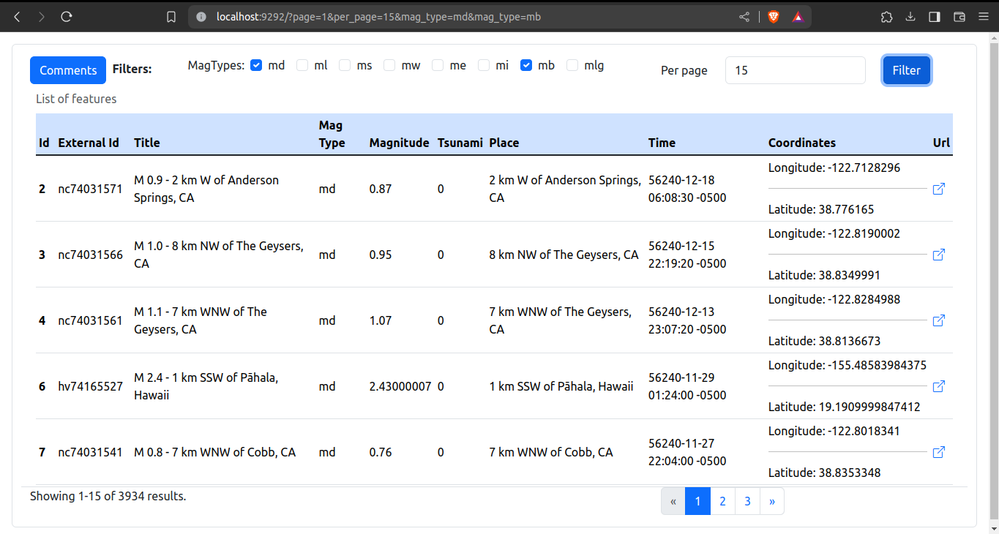
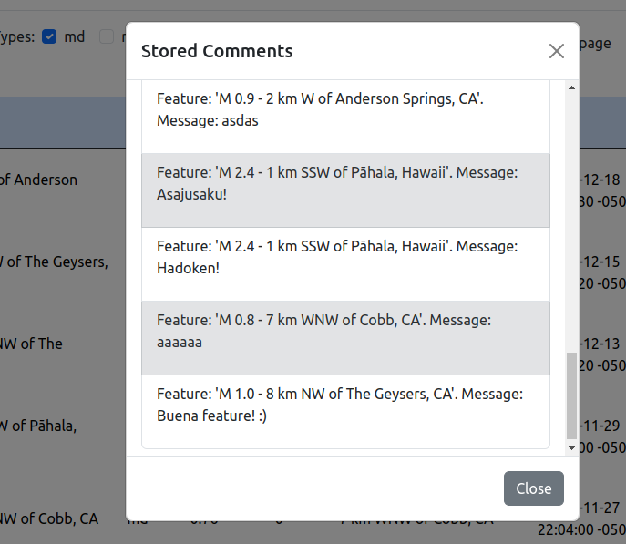
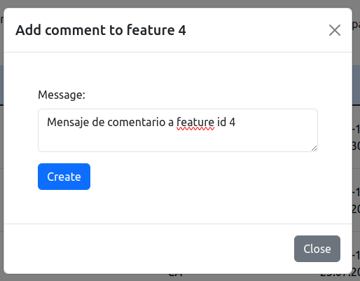
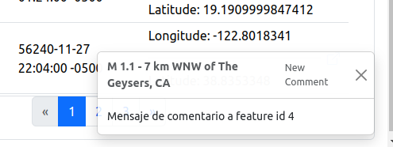

# frogmi_ruby_tech_test
Ruby api rest and task for Frogmi tech test

Autor: Luis Eduardo Martínez Bautista

### Herramientas empleadas

| Herramienta | Versión |
| ------------- | ------------- |
| Ruby  | 3.0.2p107  |
| Bundles  | 2.3.5  |
| Mariadb  | 10.4.28  |
| TypeScript  | 5.0.4  |
| Nodejs  | 18.16.0  |
| Npm  | 9.6.6  |
| Angular CLI | 16.0.6  |
| Linux Mint  | 21.1 Vera |

## Comandos

### Servidor

Ejecutar servidor
``` bash
  bundle exec rackup app.ru
```

con el argumento -p se puede especificar un puerto alterno al 

Ejecutar test
``` bash
  bundle exec ruby specs/_spec.rb
```

Ejecutar tarea para consultar y guardar features de API (Rake task)
``` bash
  bundle exec rake features:import
```

Ejecutar todos los tests (Rake task)
``` bash
  bundle exec rake test
```

### Cliente

Ejecutar servidor angular (desarrollo)
``` bash
  npm start
```

Construir aplicación (HTML)
``` bash
  ng build
```

## Endpoints

| Endpoint | Descripción |
| ------------- | ------------- |
| GET /  | index.html (frontend)  |
| GET /api/features  | Listado de features  |
| GET /api/comments/report  | Listado simple de comentarios guardados  |
| POST /api/features/{feature_id}/comments  | Inserción de un nuevo comentario asociado a una feature existente  |

## Capturas de aplicación

Lista de características


Comentarios registrados


Creación de comentario


Toast confirmación registro
